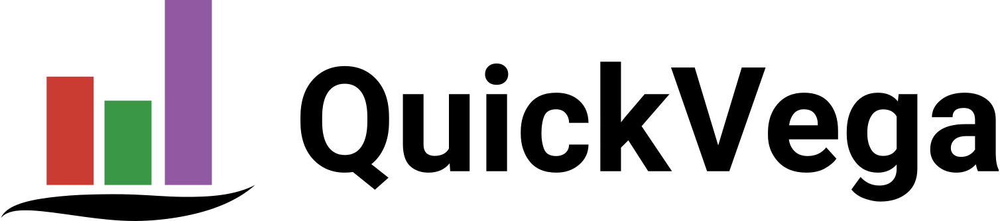

# </img>


QuickVega is a Julia high-level visualization library with Vega-Lite as a backend.
The goal of this library is to do *easy and beautiful* visualizations,
similarly to the [ Seaborn ]( https://github.com/mwaskom/seaborn ) python library.
Hence, QuickVega is a wrapper to
[VegaLite.jl]( https://github.com/queryverse/VegaLite.jl )
, providing ready-to-use visualizations.

## Proposed wishlist:
- [x] Scatter plot;
- [x] Line plot;
- [x] Bar plot;
- [x] Histogram 1D;
- [ ] Set the number of bins in the histogram;
- [ ] Histogram 2D;
- [ ] Density(KDE) plot;
- [x] Countour Plot;
- [ ] Joint Plot;
- [ ] Box Plot;
- [x] Aggregate flag, allowing for easy plot for "counting","sum", "mean", "median";
```
# Plot sum of intensity by color
QuickVega.plot(df,x=:colors,y=:intensity,y_agg="sum")
```
- [ ] Default Parameters for user to modify (e.g. user can modify the QuickVega.defaultParamters with settings such as colorschemes and size);
- [x] Dark theme (e.g. user can write setTheme!(:dark) to make plots dark);
- [ ] Create more themes (e.g. ggplot2);
- [ ] Easy addition of interactivity (e.g. `pan_zoom = true`);
- [ ] Select legend location;
- [x] Define a general `kwargs` for default plot functions, allowing
an easy way to choose colors, widths, title, etc;
- [ ] Create function to export Vega-Lite specification
for every plot function;
- [ ] Allow plotting various images one over the other, similar to
other plotting libraries, e.g.:
```julia
QuickVega.plot(x,y,label="Plot1")
QuickVega.plot(w,z,label="Plot2")
# This creates one plot with two series
```
- [ ] Allow easy plot of functions, similar to Plots.jl, .i.e:
```julia
Plots.plot(x -> x^2, 1,2)
```
- [x] Enable many color schemes;
- [ ] Easy multiple marks, .i.e:
```
QuickVega.plot(data,x=:col1,y=:col2, mark=[:circle,:line])
```
- [ ] Implement a Cheat_Sheet for the possible parameters to help users;

### Possible List of kwargs
QuickVega allows a large range of modifications to each plot, which is done via `kwargs`. Here is a list of the possible attributes, but
note that not all have been implemented yet:

* color    - specify a single color for the whole plot (e.g. color = "blue");
* color_scheme  - specify a color scheme (e.g. = "blues");
* zcolor   - this is for assigning a variable to color (e.g. color = randn(100));
* size     - this is for assigning a variable to size  (e.g. size  = randn(100));
* shape    - this is for assigning a variable to size  (e.g. size  = randn(100));
* opacity  - use a variable to be the opacity of the plot;
* strokedash - use a variable to be the opacity of the plot;
* palette  - choose a color scheme;
* width
* height
* stroke   - true or false for the line across the image;
* marktype 
* marksize 
* markopacity 
* markstroke 
* markstrokewidth
* title
* xlabel
* ylabel
* xlim
* ylim
* legend
* orient
* order
* grid
* gridx    - grid vertical true or false;
* gridy    - grid horizontal true or false;
* xscale   - example, allow log scale;
* yscale
* interactive - true or false, to enable zoom and panning;
* tooltip


