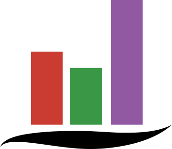

# QuickVega.jl </img>

QuickVega is a Julia high-level visualization library with Vega-Lite as a backend.
The goal of this library is to do *easy and beautiful* visualizations,
similarly to the [ Seaborn ]( https://github.com/mwaskom/seaborn ) python library.
Hence, QuickVega is a wrapper to
[VegaLite.jl]( https://github.com/queryverse/VegaLite.jl )
, providing ready-to-use visualizations.
